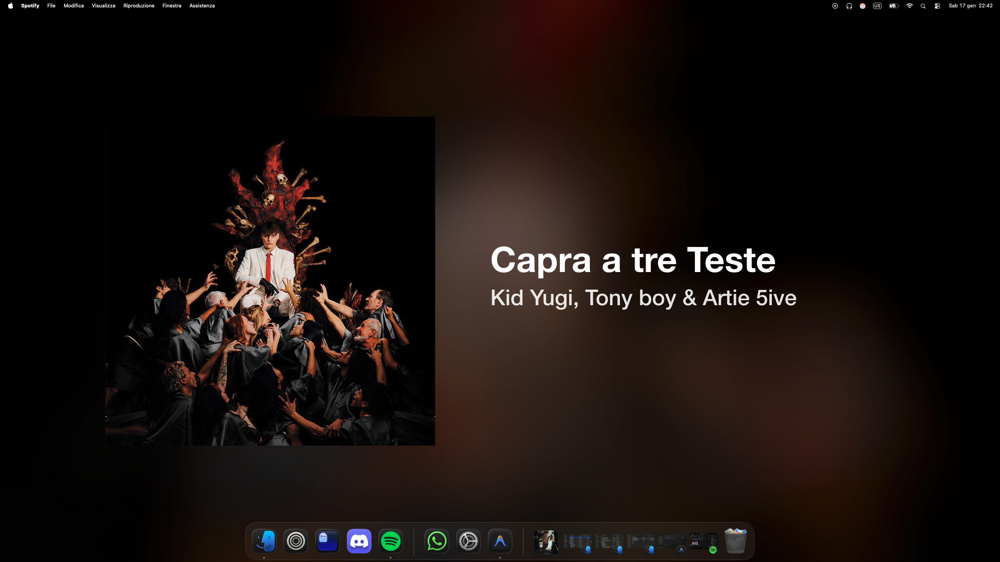
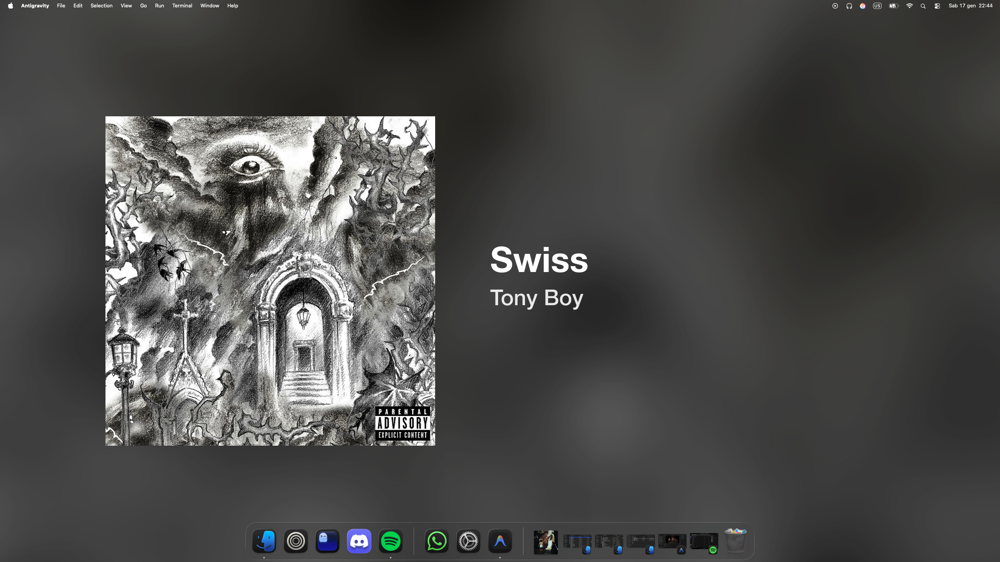
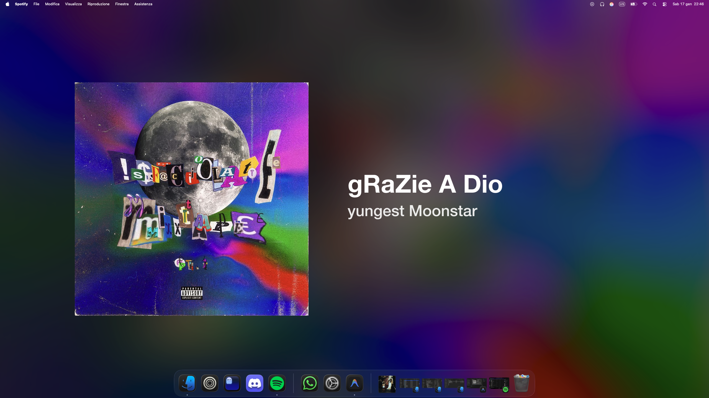
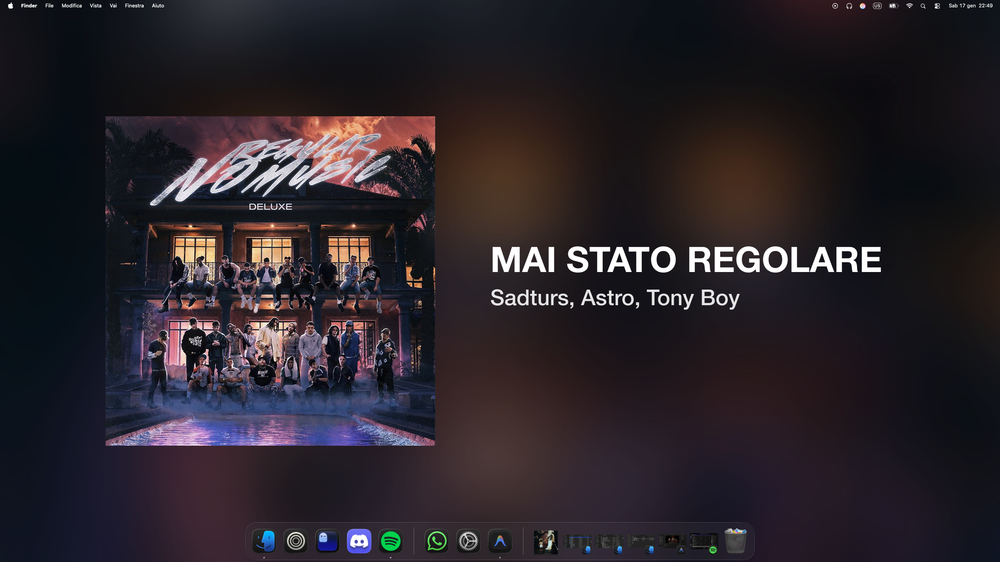

# spotify-background

A dynamic macOS desktop background generator that synchronizes your wallpaper with your Spotify playback. It automatically updates your desktop with the current track's artwork, applying a blurred background effect and metadata overlay. This project was primarily vibe-coded by Antigravity/Opencode.

## How it works
The system follows a automated workflow:
1. Retrieval of track metadata (title, artist, artwork) via AppleScript.
2. Image processing using Sharp to generate a blurred background and composite the track details.
3. Automatic application of the generated image as the system desktop wallpaper.
4. Automatic cleanup of temporary files and restoration of the original wallpaper upon exit.

## Showcase

