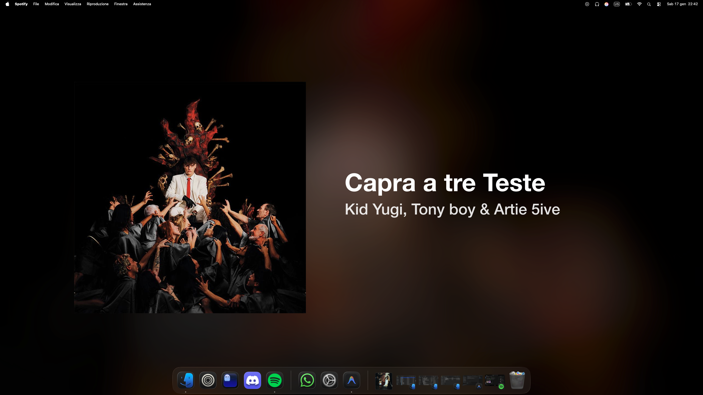
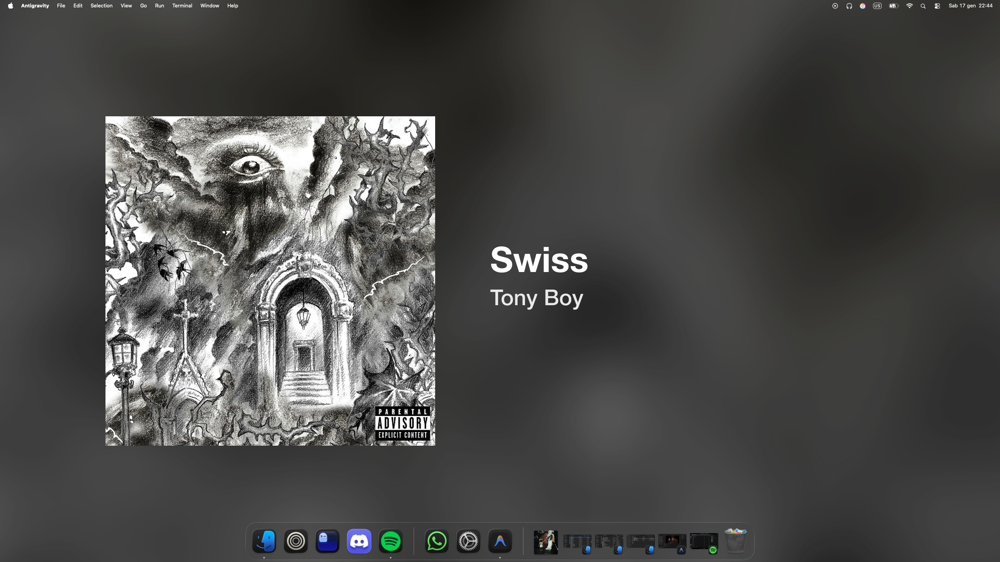
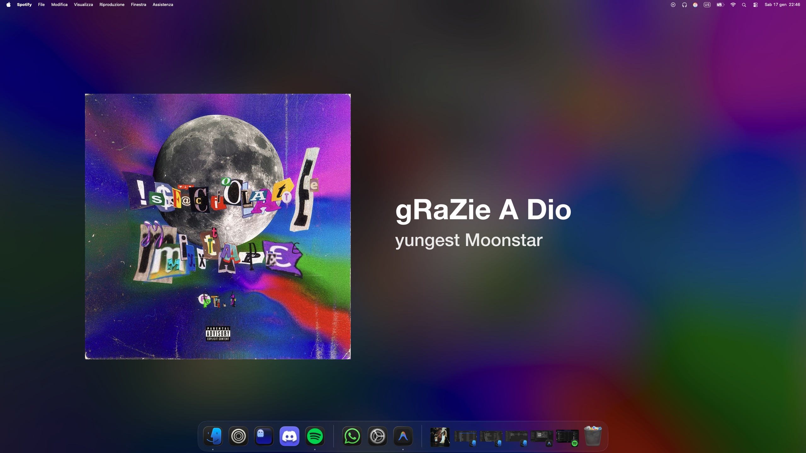
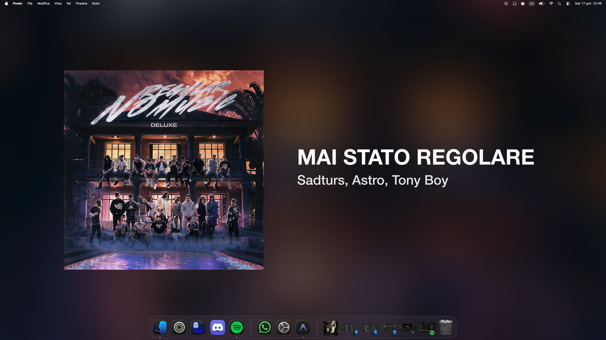

# spotify-background

A dynamic macOS desktop background generator that synchronizes your wallpaper with your Spotify playback. It automatically updates your desktop with the current track's artwork, applying a blurred background effect and metadata overlay. This project was primarily vibe-coded by Antigravity/Opencode.

## How it works

The system follows an automated workflow:

1. Retrieval of track metadata (title, artist, artwork) via AppleScript.
2. Image processing using Sharp to generate a blurred background and composite the track details.
3. Automatic application of the generated image as the system desktop wallpaper.
4. Automatic cleanup of temporary files and restoration of the original wallpaper upon exit.

## Requirements

- macOS
- Node.js 20 or newer
- pnpm
- Spotify for macOS

## Usage

```bash
pnpm install
pnpm start watch
```

Stop a background process with `pnpm start stop`. To enable or disable launch at login:

```bash
pnpm start setup install
pnpm start setup uninstall
```

macOS may ask for permission to control Spotify and System Events on first run.

## Development

Run the strict TypeScript check and the automated tests together:

```bash
pnpm check
```

## Showcase





